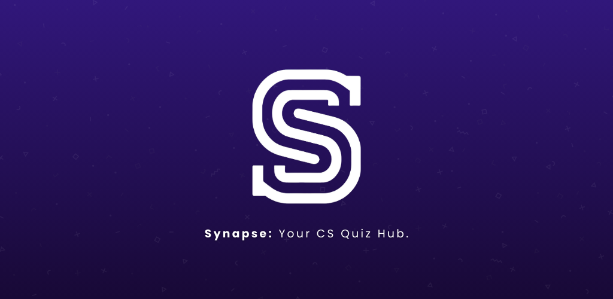
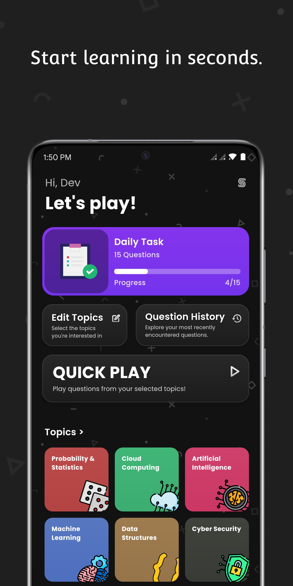
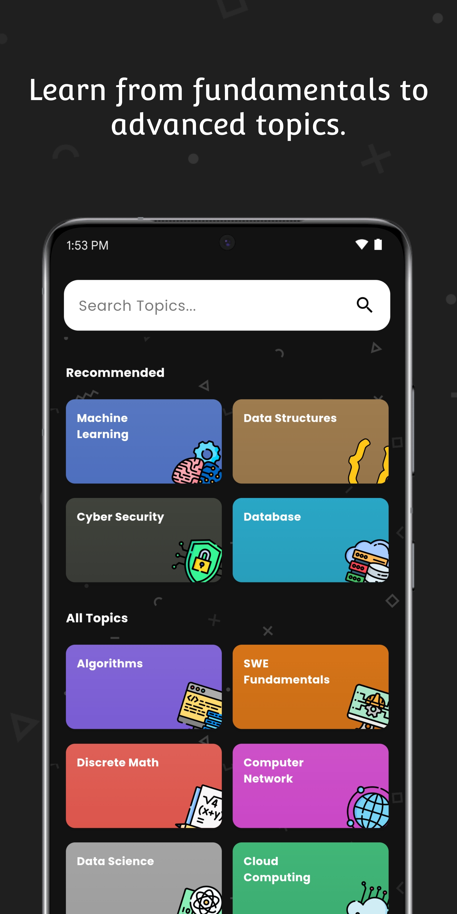
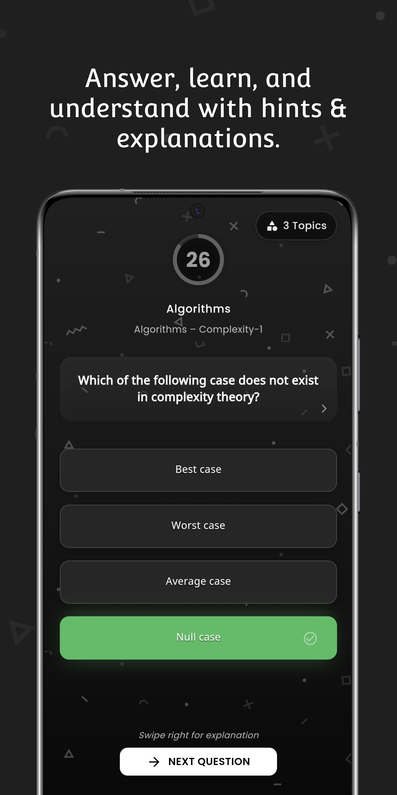
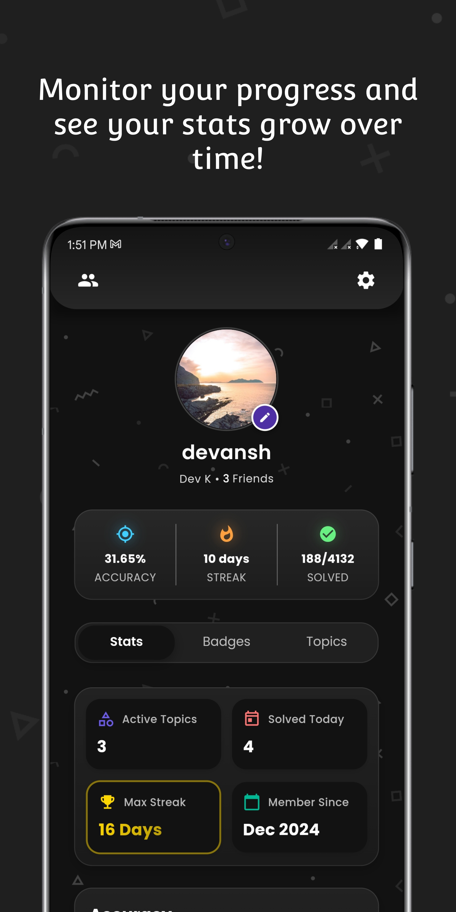
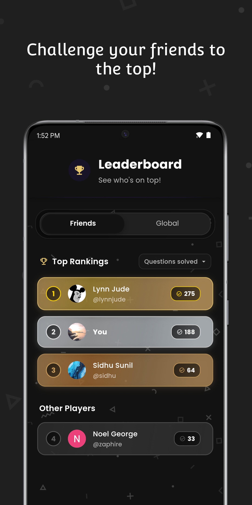
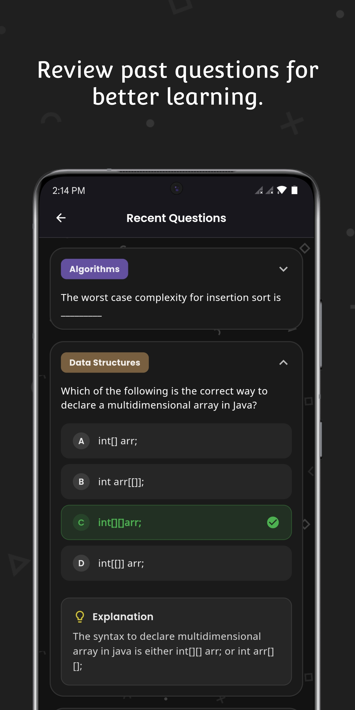

# Synapse

A modern, feature-rich quiz application built with Flutter and Firebase, offering a comprehensive quiz experience with friend leaderboards, custom generated hints, progress tracking, and more.



## Features

### User Authentication & Profile Management

- Secure email/password authentication
- Customizable user profiles with avatars
- User statistics tracking

### Quiz Experience

- Diverse question categories from Computer Science
- Real-time question delivery and progress tracking
- Multiple question formats (multiple choice, true/false)
- Dynamic hint system powered by Gemini AI
- Score tracking and performance analytics (user streaks, accuracy, etc.)
- **Question Tracking**:
  - Users' encountered questions are tracked to ensure no repeated questions are shown (can be reset)
  - Ability to review previously encountered questions for revision

### Social Features

- Friend system with user discovery
- Real-time leaderboards

### UI/UX

- Modern, intuitive interface with smooth animations
- Dark mode design with gradient accents
- Responsive layout for various device sizes

## Tech Stack

- **Frontend and Backend**: Flutter, Firebase
- **State Management**: Provider
- **Architecture**: Service-based architecture
- **Data Scraping**: Python, Selenium, bs4
- **AI Integration**: Google's Gemini API for contextual hints
- Sourced Questions from [https://sanfoundry.com/](https://sanfoundry.com/)

## Screenshots

<div align="center">
  
  
  
  
  
  
</div>

## Demo

* Mobile: [https://youtube.com/shorts/kAqLwVWDZAs?feature=share](https://youtube.com/shorts/kAqLwVWDZAs?feature=share)
* Tablet: [https://youtu.be/JBgfspfbi3A](https://youtu.be/JBgfspfbi3A)

## How to Download

**Android:**

* **Google Play Store (Closed Testing), Join Group:** [https://groups.google.com/u/1/g/synapse-testers](https://groups.google.com/g/synapse-testers)
* **Direct APK:** [APKs/](APKs/) (arm64 For most modern Android devices)

**iOS:**

Coming soon!

## Project Structure

```
lib/
├── constants.dart             # App-wide constants
├── main.dart                  # Entry point
├── models/                    # Data models
├── pages/                     # App screens
│   ├── auth/                  # Authentication screens
│   ├── main/                  # Main app screens (on navbar)
│   ├── secondary/             # Other app screens
│   ├── landing.dart           # Landing Page
│   ├── splash_screen.dart     # Splash Screen
├── providers/                 # State management
├── services/                  # API and backend services
├── utils/                     # Utility functions/classes
└── widgets/                   # Reusable UI components
    ├── auth/                  # Auth screens widgets
    ├── home/                  # Home screen widgets
    ├── profile/               # Profile screen widgets
    ├── trivia/                  # Trivia screen widgets
    └── shared_widgets.dart    # Common widgets used across the app
```

## Architecture

The application follows a service-based architecture with Provider for state management:

- **Services**: Handle API calls and data processing
- **Providers**: Manage application state and business logic
- **Pages**: Define the application's screens and navigation
- **Widgets**: Encapsulate UI components for reusability

## Contributing

Contributions are welcome, feel free to reach out to start collaborating!

## License

This project is licensed under the MIT License - see the [LICENSE](LICENSE) file for details.

---

## Contact

Devansh Kapoor - [LinkedIn](https://linkedin.com/in/devansh-kapoor) - devansh.kp@outlook.com
